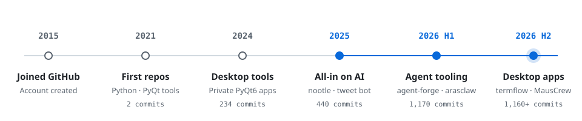

# Umut Çelik

**Civil Engineer · Software Developer**

I turn engineering problems into software — and lately, into AI agents that do the work. I build local-first desktop apps, developer tooling and agent workflows, mostly in TypeScript and Python.

AI agents &nbsp;·&nbsp; Developer tooling &nbsp;·&nbsp; Desktop apps &nbsp;·&nbsp; Engineering software &nbsp;·&nbsp; Based in Türkiye

[arabaalsat.com.tr](https://www.arabaalsat.com.tr/) &nbsp;·&nbsp; [X @palamut62](https://x.com/palamut62) &nbsp;·&nbsp; [GitHub](https://github.com/palamut62) &nbsp;·&nbsp; [Email](mailto:umutins62@hotmail.com)

 

## Journey

<picture>
  <source media="(max-width: 640px) and (prefers-color-scheme: dark)" srcset="./assets/timeline-mobile-dark.svg" />
  <source media="(max-width: 640px)" srcset="./assets/timeline-mobile-light.svg" />
  <source media="(prefers-color-scheme: dark)" srcset="./assets/timeline-dark.svg" />
  
</picture>

Commits across all branches, public and private repositories · 3,000+ since 2021.

 

## Now building

| **[MausCrew](https://github.com/palamut62/MausCrew)** — your own team of AI bots, in a chat app |
| :--- |
| A local-first desktop workspace where every contact is a real agent — Claude, Codex, Grok, Kimi and more — running on the models you already pay for. You talk to them, watch them work and approve what matters. |
| Electron · React · TypeScript &nbsp;·&nbsp; [Latest release](https://github.com/palamut62/mauscrew-releases/releases/latest) |

 

## Selected work

**[termflow-lite](https://github.com/palamut62/termflow-lite)** &nbsp;Electron · React · xterm.js 
A minimal, fast and deeply customizable cross-platform terminal. 
[termflow-lite.vercel.app](https://termflow-lite.vercel.app) &nbsp;·&nbsp;  

**[termflow](https://github.com/palamut62/termflow)** &nbsp;Electron · React · xterm.js 
Windows multi-terminal and multi-agent canvas — shells and AI agents side by side on an infinite canvas. 
 

**[PhoneShare](https://github.com/palamut62/PhoneShare)** &nbsp;PWA · FastAPI · Tauri 
Private local file transfer from iPhone to Windows — no cloud in between.

**[marknote](https://github.com/palamut62/marknote)** &nbsp;Tauri · React · Rust 
A local markdown editor for the notes you share with AI. 

**[wmole](https://github.com/palamut62/wmole)** &nbsp;Python · Rich 
Windows-first port of Mole: a terminal toolkit for cleanup, uninstall leftovers and live system status. 
[wmole.vercel.app](https://wmole.vercel.app) &nbsp;·&nbsp; 

**[ui-design-skills-pack](https://github.com/palamut62/ui-design-skills-pack)** &nbsp;Agent skills 
Reusable desktop UI/UX design skills for Codex, Claude Code and other AI coding agents. 

 

## Tech

**Languages** &nbsp; TypeScript · Python · Rust · C# 
**Desktop** &nbsp; Electron · Tauri · PyQt6 
**Frontend** &nbsp; React · Next.js · Tailwind CSS · Vite 
**Backend** &nbsp; FastAPI · PostgreSQL · Prisma · Docker 
**AI** &nbsp; LLM agents · agent skills · RAG · workflow automation

 

## Activity

 

---

Open to collaboration on AI tooling and engineering software &nbsp;·&nbsp; [X @palamut62](https://x.com/palamut62) &nbsp;·&nbsp; [umutins62@hotmail.com](mailto:umutins62@hotmail.com)
